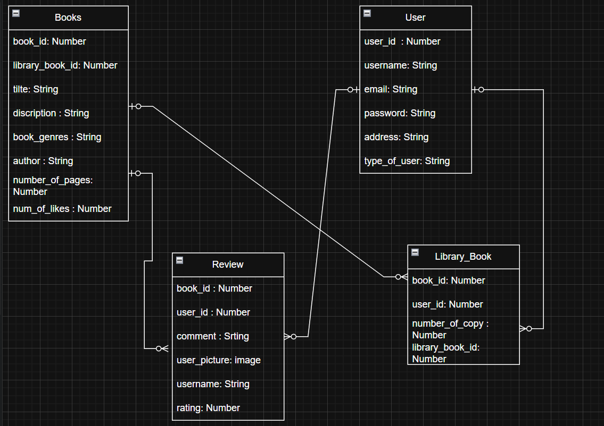

# Libraries-Club

The website will initially include 20 books with detailed descriptions and essential information such as the author, genre, description and ratings..
users will be able to add new books to the platform, write descriptions and share their opinions. other users can comment on each book, creating an interactive and engaging reading community.

*****
## idea extra
users can :
- click (I want to read this book "like ")to add  the book to their reading list.
- click (I have read this book "done") to mark it as completed.

 The system will automatically track how many books each user has read.

Reading Challenges.. The website will include reading challenges to motivate users, such as:
- Set a yearly goal.
- Track reading progress.
- Display top readers who read the most books.

This feature encourages friendly competition and builds a strong reading habit.

The platform allows users to explore books, add new titles, write reviews, comment, and track their reading progress. It includes reading challenges, yearly goals, and leaderboards to motivate users and create an engaging community for book lovers

## Information about book
number of pages:
description:
author :
genres:

## Name of Books:

 - Diary of a Wimpy Kid
 - The Alchemist
 - The Four Winds
 - Wonder
 - Matilda
 - Harry Potter and the Philosopher's Stone
 - The Fault in Our Stars
 - The Power of Habit
 - Steve Jobs
 - Oliver Twist
 - A Brief History of Time
 - Deep Work
 - Atomic Habits
 - Les Misérables
 - Welcome to the Hyunam-Dong Bookshop
 - Lessons in Chemistry
 - The 4-Hour Work Week
 -
 -
 -

## Name of website
- libraries club
- reader club

## web idea :
- https://www.goodreads.com/?ref=nav_hom
- https://www.huisvanhetboek.nl/en/collections/online-catalog

